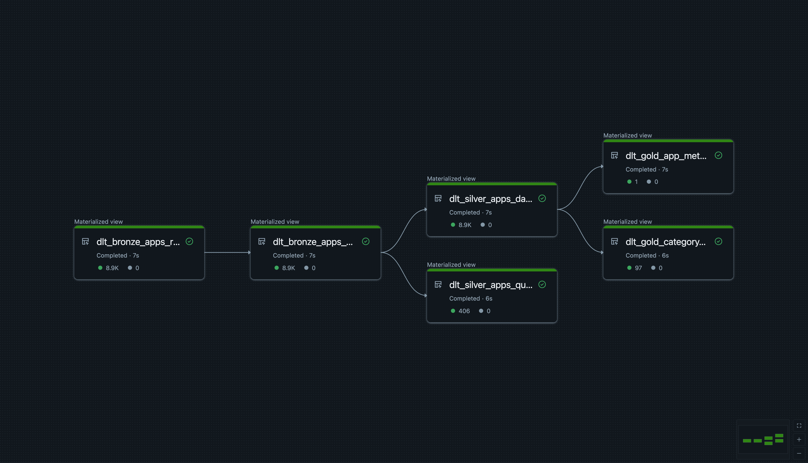

# Zapier App Insights API Platform


## Overview

End-to-end data platform that transforms daily snapshots of Zapier app data into analytical insights served via REST API. Built with **Functional Data Engineering** principles (immutability, idempotency, reproducibility).

**Key Components:**
- **Data Pipelines:** Medallion architecture (Bronze → Silver → Gold) on Databricks
- **Insights API:** FastAPI service querying Delta tables via SQL
- **Quality Framework:** Automated validation, deduplication, quarantine tables
- **Orchestration**: Regular ETL + Delta Live Tables (demonstrates orchestration versatility)

**Tech Stack:** PySpark, Delta Lake, FastAPI, Databricks SQL Connector

### Scope and Focus for This Submission

- **Emphasis on data infrastructure/pipeline**: Prioritized building a clear, reproducible medallion pipeline and an API surface over deep business-domain analysis of insights.
- **Data reasonableness not deeply validated**: Beyond structural cleaning and basic quality checks, this submission does not assess whether upstream values “make sense” from a business perspective.
- **Performance and resource tuning out of scope**: Given the dataset size and time constraints, no formal benchmarking or right-sizing of compute was performed; production tuning is deferred.

### Part A: Model & Transform ✅
- **Data exploration** - Analyzed nested JSON schema, identified natural keys
- **Transformations** - Deduplication, null handling, category flattening, surrogate key generation
- **Data models** - Silver (normalized), Gold (aggregated), Bronze - Quarantine (quality failures)

### Part B: Insights API ✅
- **3+ Insights implemented:**
  1. Premium vs Free analysis (with percentages)
  2. Category-level metrics (app counts, popularity, age)
  3. App health assessment (4 risk segments: high risk, rising stars, featured underperformers, beta graduation)
- **Queryable via SQL** - All endpoints query Delta tables
- **Correctness focus** - Type-safe models, validated responses, health checks

### Part C: Documentation ✅
- **Setup instructions** - This README + detailed `api/README.md`  +  `./docs`
- **Architecture** - Medallion layers, idempotency, surrogate keys
- **Future Work** - Future work scoped out in Future Work section


## Quick Start

### 1. Data Pipeline (Databricks)

**Option A: Regular ETL Notebook**
```bash
# In Databricks workspace
# Run: notebooks/app-insights.py
# Set widget: snapshot_date = "20251030"
# Creates: silver_apps_daily_snapshot, gold_app_metrics_daily, gold_category_metrics_daily
```

**Option B: Delta Live Tables** -
```bash
# Deploy DLT pipeline: pipelines/dlt_pipeline.py
# Configure: snapshot_date, catalog, schema in pipeline settings
# Includes automated quality expectations and data lineage
```

### 2. Insights API (Local)

**API Endpoints:**
- `GET /health` - Data freshness & connectivity
- `GET /insights/premium-analysis` - Premium vs free breakdown
- `GET /insights/categories` - Category-level metrics
- `GET /insights/app-health-assessment` - Risk segments (high risk, rising stars, featured underperformers, beta graduation)

See [`api/README.md`](api/README.md) for detailed API documentation.


## Architecture Highlights

### Data Processing (Medallion)

**Bronze Layer** (JSON files in Databricks Volumes)
- Immutable daily snapshots from `/Volumes/interview_data_pde/app_insights_assignment/raw_apps/YYYYMMDD/*.json`
- Deduplication by `slug` (natural key), keeping lowest popularity rank (lower = more popular)
- Quality validation with quarantine table for failed records

**Silver Layer** (`silver_apps_daily_snapshot`)
- Cleaned, normalized app records
- SHA2 deterministic surrogate keys (`slug || snapshot_date`)
- Flattened nested JSON (categories array)
- Partitioned by `snapshot_date` for idempotent overwrites

**Gold Layer** (Pre-aggregated metrics)
- `gold_app_metrics_daily` - Daily app-level aggregations
- `gold_category_metrics_daily` - Category-level statistics
- Optimized for API query performance


### Data Flow (DAG)



### API Design

**FastAPI** service with:
- **Type safety:** Pydantic v2 models for request/response validation
- **Auto-documentation:** OpenAPI (Swagger) & ReDoc
- **Structured logging:** Production-ready observability (structlog)
- **Direct SQL queries:** Databricks SQL connector (no ORM overhead)


## Project Structure

```
├── api/                        # FastAPI service
│   ├── src/zapier_insights/    # Application code
│   │   ├── main.py             # FastAPI app entry point
│   │   ├── routers/            # Endpoint handlers
│   │   │   ├── health.py       # Health check endpoint
│   │   │   └── insights.py     # Insights endpoints (3 implemented)
│   │   ├── models.py           # Pydantic response models
│   │   ├── database.py         # Databricks SQL connector
│   │   └── config.py           # Environment-based settings
│   ├── tests/                  # Test suite (pytest)
│   └── README.md               # Detailed API documentation
│
├── notebooks/
│   └── app-insights.py         # Regular ETL notebook (Bronze → Silver → Gold)
│
├── pipelines/
│   ├── dlt_pipeline.py         # Delta Live Tables implementation
│   └── README.md               # Pipeline documentation
│
└── docs/
    ├── PRD.md                  # Product requirements
    └── BRONZE_DATA_FORMAT.md  # Source data schema reference
```


## Production Gaps & Future Work

### Orchestration & Scheduling (Current State: Manual)

**Current Implementation:**
- Notebooks run manually via Databricks UI with widget parameter
- **Delta Live Tables** - Already implemented in `pipelines/dlt_pipeline.py` (alternative approach)

**Production Setup: Databricks Jobs**

**1. Daily Scheduled Run**
```
Job Configuration:
- Schedule: Daily at 2:00 AM UTC (configurable depending on when raw data is available)
```

**2. Backfill Historical Dates**
```
Job Configuration:
- Task Type: Notebook
- Notebook: notebooks/app-insights.py
- Parameters:
  - Key: snapshot_date
  - Value: {{backfill.iso_date}}
- Backfill settings:
  - Start date: 2025-10-22
  - End date: 2025-10-30
```

Databricks passes dates as `YYYY-MM-DD`, notebook automatically converts to `YYYYMMDD`.

**Alternative: Delta Live Tables** (already implemented)
- Continuous or triggered pipeline
- Built-in data lineage and quality checks
- See `pipelines/dlt_pipeline.py`


---

### Future Extensions (Scoped Out)

#### Data

- [ ] **Schema evolution framework** - Graceful handling of upstream changes
- [ ] **Data quality dashboard** - Completeness scores, freshness SLAs, automated validation

#### Security
- [ ] Authentication with rate limiting
- [ ] Input validation for SQL injection (currently using string interpolation)
- [ ] Access Control - Row levelel isolation

#### Reliability
- [ ] Comprehensive error handling
- [ ] Comprehensive test suite (unit + integration + E2E)

#### Observability
- [ ] RED metrics (rate, errors, duration)
- [ ] Alerting integration (PagerDuty, Slack)

#### Performance
- [ ] Redis caching layer with TTL
- [ ] Cursor-based pagination for large results

#### Testing
- [ ] Unit tests for transformations
- [ ] Integration tests for API endpoints
- [ ] Data quality tests for pipeline validations


---


## AI/LLM Usage Disclosure

**Tools Used:** Claude Code (Anthropic)

**Application Areas:**
1. **Boilerplate generation** - FastAPI router structure, Pydantic models, config templates, Delta Live Tables
2. **Documentation** - README templates, API endpoint documentation

**All AI-generated outputs:**
- ✅ Reviewed and validated for correctness
- ✅ Understood and owned by author

---

**Submission Date:** November 3, 2025
**Time Invested:** ~4 hours (focused on core functionality + documentation)
